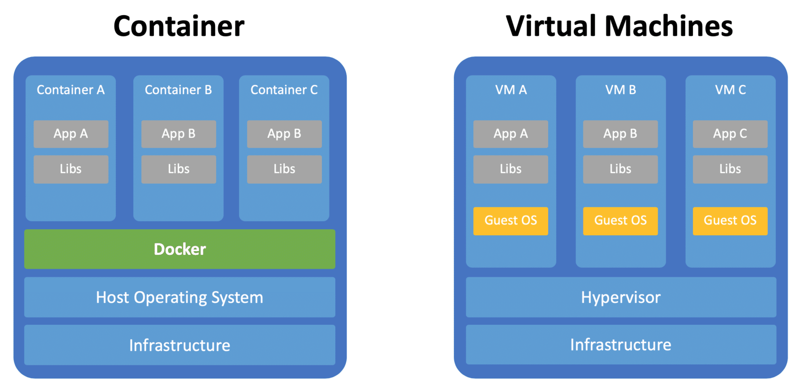

# Containerisation with Docker

## What is Docker
- Docker is an open-source platform for developing, shipping, and running applications
- It enables us to separate applications from the infrastructure
- It delivers software faster
- Docker is written in GO language

## Docker vs VM 
- Docker is lightweight and user-friendly
- Docker shares the resources of OS as opposed to using the OS completely
- Docker engine connects the container with the OS and only uses the resources required
- VM works with Hypervisor to connect guest OS/VM with Host OS

